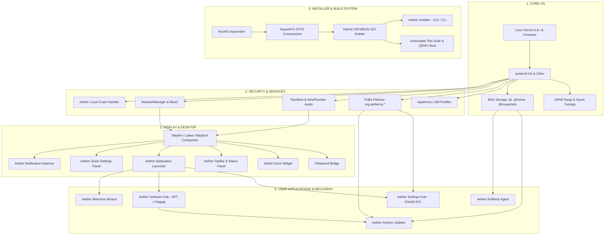

# AetherOS Component Architecture & Dependency Graph

This document details the layered breakdown of all AetherOS subsystems, the end-to-end component dependency graph, and the rationale for every selected technology.

---

## 1. Subsystem Classification Matrix

Every component in AetherOS belongs to one of the ten distinct architectural layers:

| Layer | Primary Role | Core Technologies Selected | Selected Rationale (Lightest Mature Solution) |
|---|---|---|---|
| **1. CORE OS** | Kernel, init, device management, filesystems | Linux Kernel 6.8+ LTS, systemd, UDev, Btrfs with ZSTD, zRAM | Linux 6.8 HWE offers broad hardware compatibility; systemd is the standard socket-activated init; zRAM provides ultra-fast RAM compression without disk swap wear. |
| **2. DESKTOP** | Wayland compositor, window management, shell UI | Wayfire (primary), Labwc (fallback), XWayland, Aether Shell (Dock, TopBar, Launcher, QuickSettings) | `wlroots`-based compositors provide hardware acceleration and Ubuntu-like tiling with ~40MB idle RAM vs GNOME Shell's ~450MB. |
| **3. SYSTEM SERVICES** | Hardware integration, audio, networking, bluetooth | PipeWire, WirePlumber, NetworkManager, BlueZ 5, CUPS | PipeWire replaces PulseAudio and JACK with unified low-latency audio routing; NetworkManager handles fast Wi-Fi roaming and MAC randomization. |
| **4. USER APPLICATIONS** | Core first-party system utilities and desktop apps | `aether-settings`, `aether-software`, `aether-updater`, `aether-welcome`, `aether-terminal` | Native, lightweight Python/GTK and Bash utilities consuming minimal memory and supporting instant Arabic RTL layout switching. |
| **5. PACKAGE MANAGEMENT** | System packages and sandboxed app distribution | APT, `dpkg`, Flatpak with Flathub | APT ensures rock-solid base system updates; Flatpak delivers sandboxed desktop applications without dependency conflicts. |
| **6. INSTALLER** | Live USB bootstrap, disk partitioning, system setup | Aether Installer Engine (Btrfs subvolume generator, Calamares compatible) | Fast, scriptable Python/GTK installer with English and Arabic RTL support, automated Btrfs layout, and unattended CLI mode. |
| **7. BUILD SYSTEM** | Rootfs assembly, SquashFS compression, ISO generation | `build-rootfs.py`, `build-iso.py`, `mksquashfs` (ZSTD:19), `xorriso`, GRUB hybrid | Deterministic, unprivileged-friendly build scripts producing reproducible UEFI/BIOS hybrid ISOs with SHA256 checksum verification. |
| **8. TESTING** | Automated unit, integration, security, and boot tests | `unittest`, Polkit XML validators, AppArmor linters, QEMU headless boot runner | Fast local test runner verifying packaging syntax, RTL locale completeness, security policies, and virtual machine bootability. |
| **9. SECURITY** | Access control, confinement, zero telemetry | AppArmor LSM, Polkit (`org.aetheros.*`), `aether-crash-handler` | AppArmor enforces path-based confinement; Polkit eliminates sudo leaks; local crash handler redacts private data with zero telemetry. |
| **10. RECOVERY** | Transactional safety, boot failure detection, rollbacks | Btrfs Snapshots, `aether-rollback-agent`, GRUB-btrfs | Read-only atomic snapshots before upgrades; automatic rollback if 3 consecutive boots fail to reach graphical desktop. |

---

## 2. Component Dependency Graph

---

## 3. Detailed Technology Trade-Off Decisions

### Compositor Choice: Wayfire / Labwc vs GNOME Shell / KDE Plasma
- *Evaluated:* GNOME Shell (Mutter), KDE Plasma (KWin), Wayfire (wlroots), Labwc (wlroots).
- *Decision:* **Wayfire** as primary 3D Wayland compositor; **Labwc** as fallback.
- *Rationale:* GNOME Mutter consumes 400MB–650MB idle RAM and is tightly coupled to systemd user services. Wayfire and Labwc provide hardware-accelerated animations, smooth window tiling, and sub-100MB RAM footprint while supporting standard Wayland layer-shell protocols for our modular desktop dock, topbar, and quick settings widgets.

### Audio Architecture: PipeWire vs PulseAudio + ALSA
- *Evaluated:* Legacy PulseAudio, pure ALSA, PipeWire.
- *Decision:* **PipeWire + WirePlumber**.
- *Rationale:* PipeWire unifies desktop audio, Bluetooth audio profiles, and professional low-latency JACK audio into a single lightweight daemon. It reduces audio latency to 256 samples (5.3ms) with lower CPU usage and seamless Bluetooth codec negotiation.

### Network Architecture: NetworkManager vs systemd-networkd
- *Evaluated:* `systemd-networkd` + `iwd`, `NetworkManager`.
- *Decision:* **NetworkManager**.
- *Rationale:* While `systemd-networkd` is lightweight for servers, NetworkManager provides rock-solid desktop VPN management, captive portal detection, mobile broadband support, and D-Bus APIs for our Quick Settings panel. MAC address randomization is enabled in configuration for privacy.

### Storage & Rollback: Btrfs Subvolumes vs ZFS vs LVM-Thin
- *Evaluated:* Btrfs, ZFS on Linux, LVM-thin snapshots, EXT4 + Timeshift rsync.
- *Decision:* **Btrfs Subvolumes (`@`, `@home`, `@snapshots`, `@var_log`) with ZSTD:3 compression**.
- *Rationale:* Btrfs is built into the upstream Linux kernel without out-of-tree DKMS licensing issues (unlike ZFS). It provides instant subvolume snapshotting and transparent compression without the write-amplification overhead of LVM-thin or rsync-based file copies.
